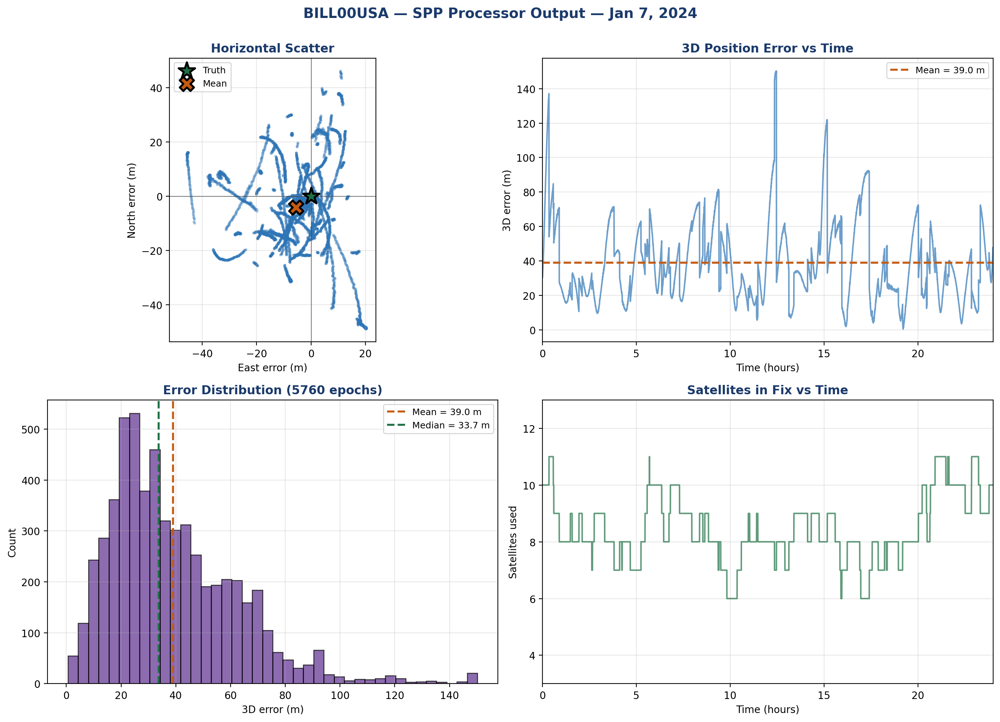
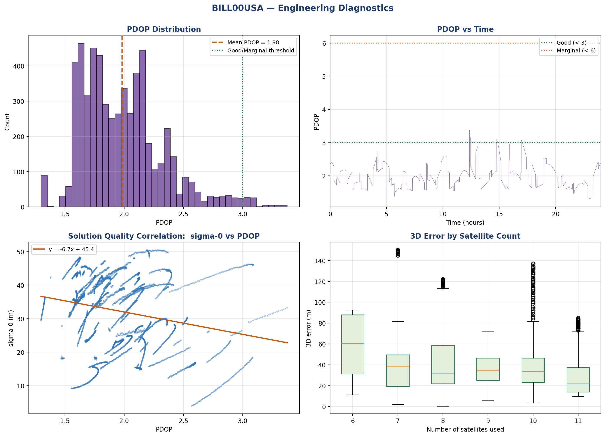
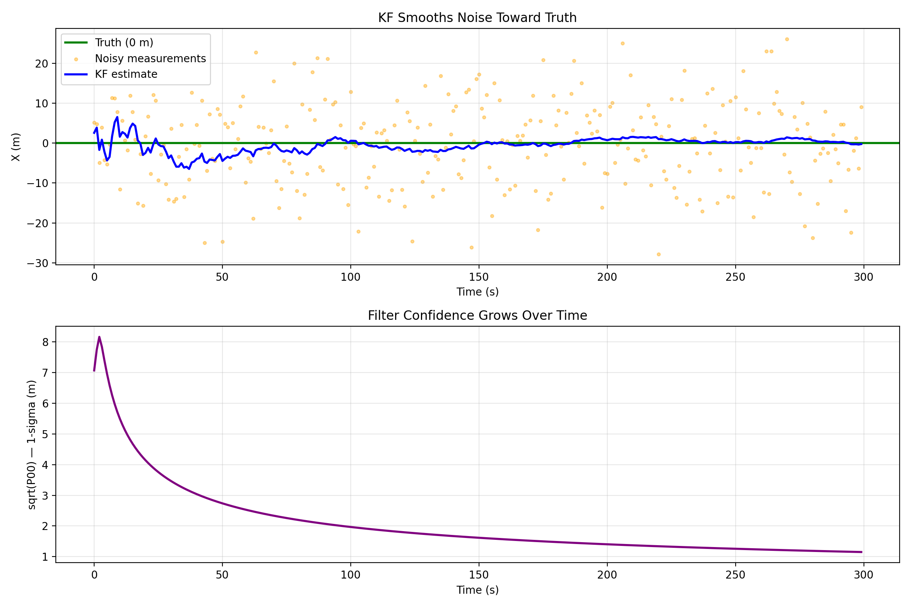

# GNSS Sensor Fusion & Kalman Filter & Orbit Determination Engine — C++

> **A from-scratch implementation of GNSS positioning algorithms in modern C++**, built as part of a structured 6-month curriculum targeting navigation engineering roles in spacecraft and ground GNSS systems.

[]()
[]()
[]()
[]()
[]()

---

## What This Engine Does (as of Month 2 complete)
 
- Parses RINEX 3 navigation and observation files
- Computes GPS satellite positions from broadcast ephemerides (IS-GPS-200)
- Applies full satellite clock corrections:
  - Polynomial (bias + drift + drift rate)
  - Relativistic (Kepler-based)
  - TGD (Timing Group Delay)
- Corrects for Earth rotation during signal travel (Sagnac effect)
- Applies elevation masking (configurable, default 10 deg)
- Models ionospheric delay via Klobuchar 8-parameter model
- Models tropospheric delay via Saastamoinen with standard atmosphere
- Solves receiver position via iterative weighted least-squares (Eigen)
- Computes 5 DOP quality metrics (GDOP/PDOP/HDOP/VDOP/TDOP)
- Processes multi-epoch RINEX files (24-hour trajectories)
- Outputs trajectory CSV + portfolio-quality analysis plots

--

## 🌌 Sample Output

## Sample Result
 
Real BILL00USA IGS reference station, Jan 7 2024, 24-hour trajectory:
 
- **5,760 epochs processed** at 15-second intervals
- **~95% convergence rate** (fixes with 4+ satellites)
- **~40m single-epoch RMS** (typical for single-frequency SPP)
- **PDOP consistently 1.5-3.0** (excellent geometry)
 

 


---

## Repo Structure
 
```
Month1/  Foundations — Kalman family, coordinates, RINEX basics
Month2/  GPS Positioning — this is where you are
  Week5/  Satellite ephemeris computation
  Week6/  Least-squares position solver
  Week7/  DOP analysis + sky plot visualization
  Week8/  Atmospheric corrections (Klobuchar + Saastamoinen)
  Week9/  Multi-epoch SPP processor + analysis
```
 
## Roadmap
 
- Month 3 (in progress): Kalman filtering for positioning (target: 5-15m RMS)
Standalone KF verification on synthetic data (Week 10):



- Month 4: GNSS/INS sensor fusion (15-state error-state EKF)
- Month 5: LEO orbit determination
- Month 6: ROS 2 integration + real-time pipelines
``

---

## 🛠️ Tech Stack

| Layer | Technology |
|---|---|
| **Language** | C++17 (modern features: structured bindings, `auto`, lambdas) |
| **Build** | CMake 3.15+ |
| **Linear Algebra** | Eigen 3.4 |
| **Visualization** | Python 3 + matplotlib + folium + pandas |
| **Version Control** | Git |
| **Data Sources** | NASA CDDIS, IGS, UNR Geodesy Lab |
| **Platform** | Windows (Visual Studio MSVC) — portable to Linux |

---

## 🧪 How to Build and Run

Each project folder is self-contained with its own `CMakeLists.txt`.

```bash
# Navigate to any project
cd Month2/Week5/3rd_All_Visible_Sats

# Configure
cmake -B build

# Build (Release for speed)
cmake --build build --config Release

# Run
cd build/Release
./all_visible_sats.exe
```

**Requirements:** CMake ≥ 3.15, C++17 compiler (MSVC/GCC/Clang), Eigen 3.4 (only for KF projects in Weeks 1–3).

---

## 📖 Key Engineering Concepts Demonstrated

- **State Estimation:** KF, EKF, UKF, Particle Filter
- **Orbital Mechanics:** Keplerian elements, satellite position from broadcast ephemerides
- **Coordinate Systems:** LLA, ECEF, ENU, transformations between them
- **Geodesy:** WGS84 ellipsoid, Haversine distance, great-circle geometry
- **Data Engineering:** NMEA parsing, RINEX 2/3 OBS and NAV parsing, multi-GNSS support
- **Modern C++17:** RAII, structured bindings, lambdas, `std::map`, `const &` semantics
- **Defensive Coding:** `safe_stod`, `safe_substr`, `nullptr` checks, week-rollover handling
- **Build Systems:** Cross-platform CMake configuration
- **Visualization:** Interactive maps (folium), polar sky plots (matplotlib)

---

## 👨‍💻 About Me

I'm **Hadi Heydarizadeh Shali**, a PhD candidate in Earth Sciences (Geodesy concentration) at the University of Memphis, expected graduation **December 2026**. My research focuses on GNSS time-series analysis, station velocity estimation, and ground deformation monitoring.

This portfolio bridges my academic background in geodesy with the C++ software engineering skills needed for industry navigation roles.

📫 **Contact:**
- Email: hadi.heydarizadeh@gmail.com
- LinkedIn: [linkedin.com/in/hadihshali](https://www.linkedin.com/in/hadihshali/)
- GitHub: [github.com/HadiHShali](https://github.com/HadiHShali)

---

## 📚 References

Implementations follow the official specifications and authoritative sources:

- **GPS Interface Specification IS-GPS-200** — Section 20.3.3.4.3 (satellite position algorithm)
- **Misra & Enge** — *Global Positioning System: Signals, Measurements, and Performance* (2nd ed.)
- **Kaplan & Hegarty** — *Understanding GPS/GNSS: Principles and Applications* (3rd ed.)
- **ESA Navipedia** — [GPS Satellite Coordinates Computation](https://gssc.esa.int/navipedia/index.php/GPS_Satellite_Coordinates_computation)
- **RINEX 3.04 Specification** — IGS Documentation
- **NASA CDDIS** — Continuous data archive for GNSS observations

---

## 📅 Updated Monthly

This README is updated at the end of each month with new accomplishments, screenshots, and milestones. **Last update: End of Week 5, Month 2.**

---

*Built one day at a time. The goal isn't speed — it's understanding every line.*
